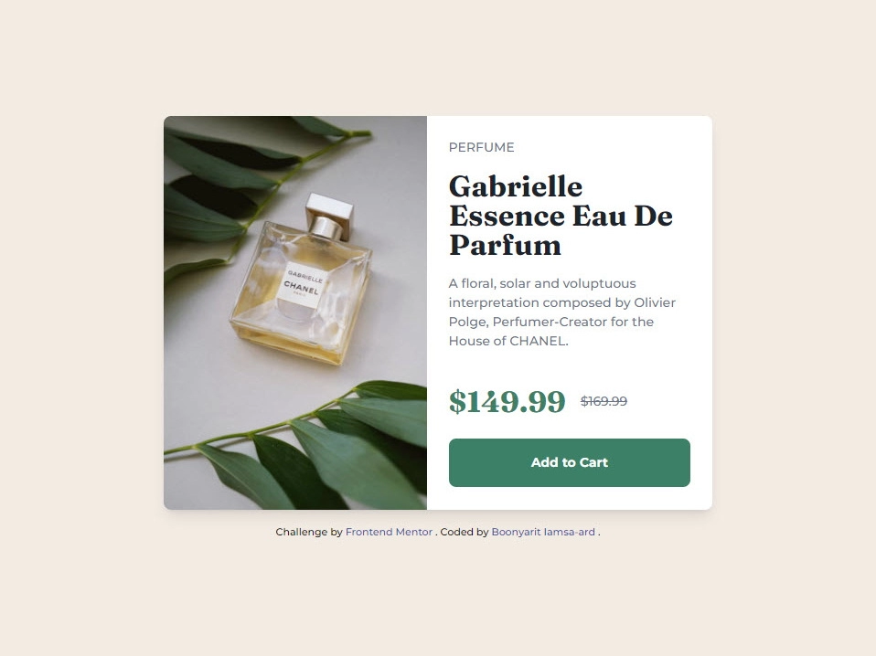

# Frontend Mentor - Product preview card component solution

This is a solution to the [Product preview card component challenge on Frontend Mentor](https://www.frontendmentor.io/challenges/product-preview-card-component-GO7UmttRfa). Frontend Mentor challenges help you improve your coding skills by building real projects.

## Table of contents

- [Overview](#overview)
  - [The challenge](#the-challenge)
  - [Screenshot](#screenshot)
  - [Links](#links)
- [My process](#my-process)
  - [Built with](#built-with)
  - [What I learned](#what-i-learned)
  - [Continued development](#continued-development)
  - [Useful resources](#useful-resources)
  - [Author](#author)

## Overview

### The challenge

Users should be able to:

- View the optimal layout depending on their device's screen size
- See hover and focus states for interactive elements

### Screenshot



### Links

- Solution URL: [GitHub](https://github.com/boonyarit-iamsaard/fm-product-preview-card-component)
- Live Site URL: [Live Preview](https://boonyarit-iamsaard.github.io/fm-product-preview-card-component/)

## My process

### Built with

- CSS custom properties
- Utility classes
- BEM methodology
- Flexbox
- Mobile-first workflow

### What I learned

[How to use HSL and calc functions in CSS to build darken and light colors](https://dev.to/danywalls/how-to-use-hsl-and-calc-functions-in-css-for-creating-darken-and-light-colors-3kbn) for hover and focus states of interactive elements.

See the code snippet below:

```css
:root {
  --clr-primary-h: 158;
  --clr-primary-s: 36%;
  --clr-primary-l: 37%;
  --clr-primary: var(--clr-primary-h), var(--clr-primary-s), var(--clr-primary-l);
}

.product-card__button {
  background-color: hsl(var(--clr-primary));
}

.product-card__button:hover,
.product-card__button:focus {
  background-color: hsl(
    var(--clr-primary-h),
    var(--clr-primary-s),
    calc(var(--clr-primary-l) - 15%) /* darken primary color by 15% */
  );
}
```

### Continued development

- Learn more on how to approach media queries properly.

### Useful resources

- [[Scrimba] Build a space travel website by Kevin Powell](https://scrimba.com/learn/spacetravel) - This free resource helped me on how to approach CSS custom properties, utility classes, and responsive layout with grid and flexbox.

## Author

- Website - [Boonyarit Iamsa-ard](https://github.com/boonyarit-iamsaard)
- Frontend Mentor - [@boonyarit-iamsaard](https://www.frontendmentor.io/profile/boonyarit-iamsaard)
